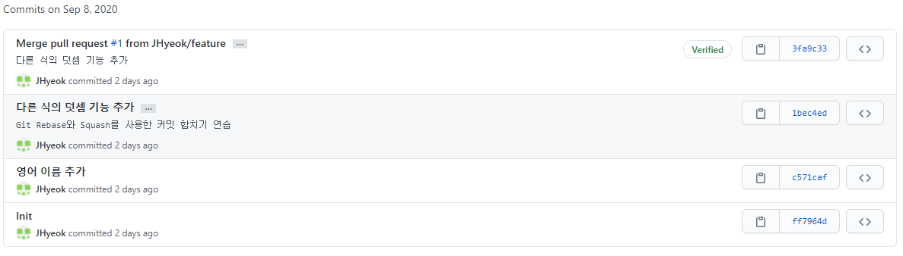
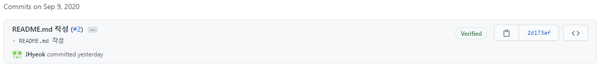
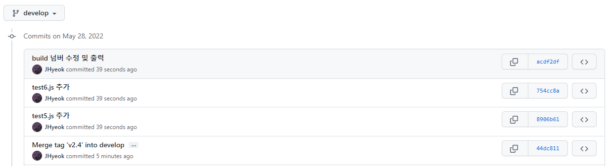
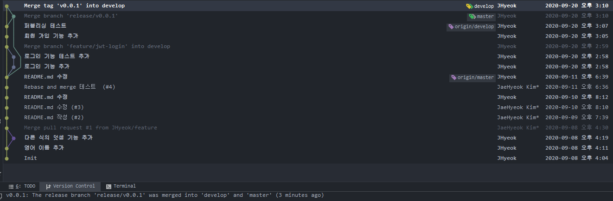
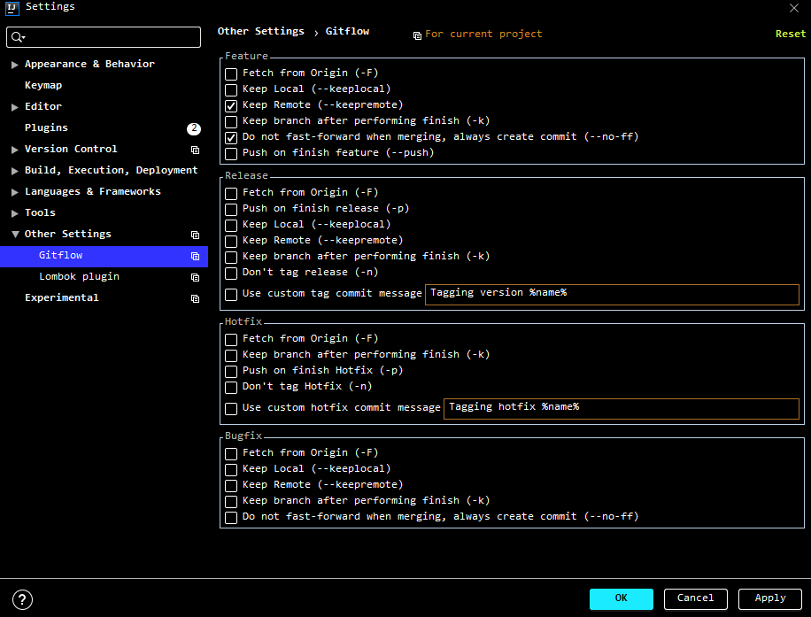
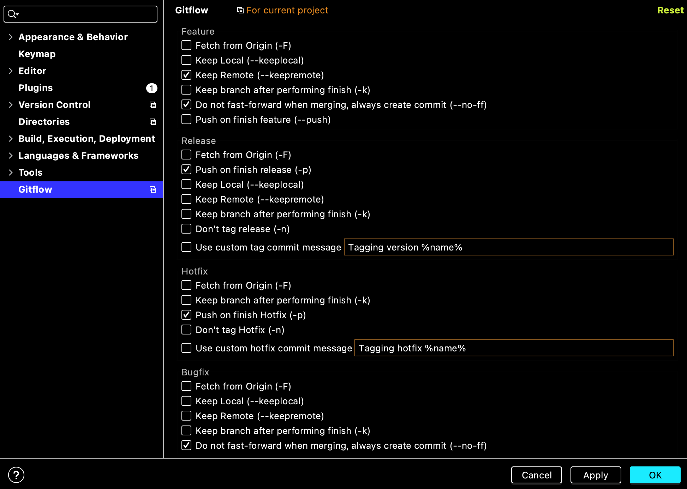

### 1. 새로운 기능을 만들고 브랜치의 커밋 메시지를 합치고 수정하기

- `feature` 브랜치 생성한다.

`git checkout -b feature`

- `feature` 브랜치에서 두 개의 변경사항을 적용한 커밋을 추가한다.
- 전체의 기능을 부분적으로 쪼개서 커밋을 했다고 가정한다.

`git commit -m "2의 덧셈 기능 추가"`

`git commit -m "3의 덧셈 기능 추가"`

`git commit -m "다른 식의 덧셈 기능 추가"`

- feature 브랜치에서 위의 덧셈 기능을 하나의 커밋으로 합치려고 한다.
- `pick`을 `squash`로 변경해주면 되는데, `pick`과 `squash`를 설정하고 저장하고 나가면 커밋을 수정하는 창이 나온다.
- 3개의 커밋에서 `b8914d1`, `e947fbd`을 삭제하고 마지막 커밋에서 원하는 커밋 메시지로 변경한다.

`git rebase -i HEAD~3`

```
pick b8914d1 2의 덧셈 기능 추가
squash e947fbd 3의 덧셈 기능 추가
squash 4909524 다른 식의 덧셈 기능 추가
```

- 로그를 확인해본다.
`git log --pretty=oneline`

```
b14f9fb9018a241abf1e5e151943f911807cc976 (HEAD -> feature) 다른 식의 덧셈 기능을 추가합니다(git squash 연습)
c571caf9ad68582386b96fae18c32085e1c01e80 (origin/master, master) 영어 이름 추가
ff7964d6511e96bd5af87d38c0789be3f7bca138 Init
```

- 하지만 커밋 메시지가 마음에 들지 않아서 메시지를 변경하고 싶다.
`git commit --amend -m "다른 식의 덧셈 기능 추가" -m "Git Rebase와 Squash를 사용한 커밋 합치기 연습"`

- remote 저장소의 feature 브랜치에 push를 한다.
`git push -f -u origin feature`

- GitHub 플랫폼을 이용해서 feature 브랜치를 master 브랜치와 합친다.
`GitHub Compare and Pull Request`

- 직접 실습을 통해서 했는데 여러 시행착오가 있었다.
- push 하지 않은 커밋들에 대해서 squash 하는 것이 정신 건강에 이로울 것 같다.

### 2. Pull Request에서 Merge의 방법들

- Merge



- Squash and Merge



- Rebase and Merge



- 참고 : https://meetup.toast.com/posts/122

### 3. Git Flow

- `Settings-Plugins`에서 `Git Flow Integration` 플러그인 설치한다.

- `Windows` 사용자의 경우, `Git 2.6.4` 이상의 버전이라면 `GitFlow(AVH 버전)`가 포함되어 있다.

- `Mac OS` 사용자의 경우, `brew install git-flow-avh`로 설치한다.

- `Start Feature`로 `Feature` 브랜치를 만들고, 커밋하면서 `Feature` 작업이 완료가 되면, `Finish Feature`를 하면 된다.



- 별도의 브랜치를 만들어서 `Git Flow`의 `Start Feature`를 하고 별도의 브랜치로 전환해서 직접 `Merge`하는 방식으로도 사용한다.

- 직접 머지할 때는 해당 브랜치에서 `Pull`을 해서 원격 브랜치와 싱크를 맞추어주고 진행한다.

- 충돌이 나는 경우 `IntelliJ`, `WebStorm`등의 `IDE`에서 환경에서 해결한다.

- `IntelliJ`, `WebStorm`등의 `IDE`에서 환경설정에서 `Git Flow` 플러그인의 옵션들을 설정할 수 있다.



- 작업중에 다른 이슈를 처리해야 한다면 `Stash` 기능을 사용하면 된다. 작업한 내용들을 임시로 어딘가에 저장해 두고 원할 때 꺼내서 적용할 수 있다.

### 3-1. Gif Flow Release/Hotfix

- 실제 서버에도 tag 정보를 적용시키기 위해서 `git push --tags origin master` 해야한다.

- 아니면 git flow 설정에서 아래 그림과 같이 설정한다.



### etc

- 연습을 위한 테스트

### 4. 읽으면 도움 되는 글

- [Git Flow 개념 이해하기](https://uxgjs.tistory.com/183)

- [쉽게 살펴보는 git, git-flow 명령어](https://moood.dev/git/git-command/)


